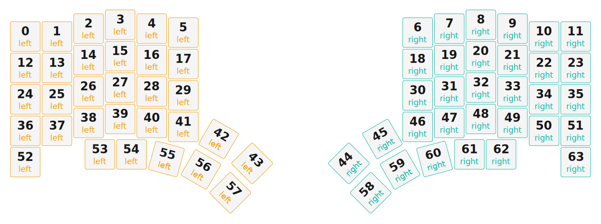

# ZMK Configuration for EndEffector

*Generated by Shield Wizard for ZMK*



Download compiled firmware from the Actions tab. <https://zmk.dev/docs/user-setup#installing-the-firmware>

Edit your keymap <https://zmk.dev/docs/keymaps>.
User keymap is located at [`config/endeffector.keymap`](config/endeffector.keymap).

-----

<details>
<summary>
Shield Wizard Debug Information
</summary>

In case of broken configuration, here is the Shield Wizard internal data used to generate this configuration:

Commit: 63ab9b7bd8845252979f45da72f40210b0b1a3ae

```json
{"name":"EndEffector","shield":"endeffector","dongle":true,"modules":[],"layout":[{"id":"01KV846G0PP91XPFNY8FNNVHFD","part":0,"row":0,"col":0,"w":1,"h":1,"x":0.003,"y":0.375,"r":0,"rx":0,"ry":0},{"id":"01KV846G0P1EBZKVZYPFXS7R47","part":0,"row":0,"col":1,"w":1,"h":1,"x":1.003,"y":0.375,"r":0,"rx":0,"ry":0},{"id":"01KV846G0PPDZBRDZH85S0XGGQ","part":0,"row":0,"col":2,"w":1,"h":1,"x":2.003,"y":0.125,"r":0,"rx":0,"ry":0},{"id":"01KV846G0P5J0H4GA1X0TZM6V7","part":0,"row":0,"col":3,"w":1,"h":1,"x":3.003,"y":0,"r":0,"rx":0,"ry":0},{"id":"01KV846G0PMCGEVA17JQXEBS52","part":0,"row":0,"col":4,"w":1,"h":1,"x":4.003,"y":0.125,"r":0,"rx":0,"ry":0},{"id":"01KV846G0PDCQNY5H4SK9BN9Q8","part":0,"row":0,"col":5,"w":1,"h":1,"x":5.003,"y":0.25,"r":0,"rx":0,"ry":0},{"id":"01KV846G0PD8P38E2Q4DN4X62Z","part":1,"row":0,"col":11,"w":1,"h":1,"x":12.416,"y":0.25,"r":0,"rx":0,"ry":0},{"id":"01KV846G0PKM4YVQ4HMTCZ0GZM","part":1,"row":0,"col":12,"w":1,"h":1,"x":13.416,"y":0.125,"r":0,"rx":0,"ry":0},{"id":"01KV846G0PADD3PF7EY6MY667S","part":1,"row":0,"col":13,"w":1,"h":1,"x":14.416,"y":0,"r":0,"rx":0,"ry":0},{"id":"01KV846G0PGH0R4H6Q1TM4HS9Q","part":1,"row":0,"col":14,"w":1,"h":1,"x":15.416,"y":0.125,"r":0,"rx":0,"ry":0},{"id":"01KV846G0PVW2BPDKH7J4BZ6R0","part":1,"row":0,"col":15,"w":1,"h":1,"x":16.416,"y":0.375,"r":0,"rx":0,"ry":0},{"id":"01KV846G0PFJF6ZY421BJ5RTJ5","part":1,"row":0,"col":16,"w":1,"h":1,"x":17.416,"y":0.375,"r":0,"rx":0,"ry":0},{"id":"01KV846G0P27K429BK9J2RTA6X","part":0,"row":1,"col":0,"w":1,"h":1,"x":0.003,"y":1.375,"r":0,"rx":0,"ry":0},{"id":"01KV846G0P1X5F0V92RV0FXAAJ","part":0,"row":1,"col":1,"w":1,"h":1,"x":1.003,"y":1.375,"r":0,"rx":0,"ry":0},{"id":"01KV846G0PSH8KM2SZWPF4T6Q0","part":0,"row":1,"col":2,"w":1,"h":1,"x":2.003,"y":1.125,"r":0,"rx":0,"ry":0},{"id":"01KV846G0PBQDFJ837V72B85WE","part":0,"row":1,"col":3,"w":1,"h":1,"x":3.003,"y":1,"r":0,"rx":0,"ry":0},{"id":"01KV846G0PKVAXR7Z705PDVCH5","part":0,"row":1,"col":4,"w":1,"h":1,"x":4.003,"y":1.125,"r":0,"rx":0,"ry":0},{"id":"01KV846G0PJ4FGGXMKS6480FNF","part":0,"row":1,"col":5,"w":1,"h":1,"x":5.003,"y":1.25,"r":0,"rx":0,"ry":0},{"id":"01KV846G0P4ZZKB4JQ8PBDF727","part":1,"row":1,"col":11,"w":1,"h":1,"x":12.416,"y":1.25,"r":0,"rx":0,"ry":0},{"id":"01KV846G0PTYVQTJ7BWXB34RP0","part":1,"row":1,"col":12,"w":1,"h":1,"x":13.416,"y":1.125,"r":0,"rx":0,"ry":0},{"id":"01KV846G0PW554ZG98HD73HTKF","part":1,"row":1,"col":13,"w":1,"h":1,"x":14.416,"y":1,"r":0,"rx":0,"ry":0},{"id":"01KV846G0PDVH9SGAWQ1PNB29Y","part":1,"row":1,"col":14,"w":1,"h":1,"x":15.416,"y":1.125,"r":0,"rx":0,"ry":0},{"id":"01KV846G0PS0HFF0RME378BHRV","part":1,"row":1,"col":15,"w":1,"h":1,"x":16.416,"y":1.375,"r":0,"rx":0,"ry":0},{"id":"01KV846G0PE2SCVQ40AP794P2M","part":1,"row":1,"col":16,"w":1,"h":1,"x":17.416,"y":1.375,"r":0,"rx":0,"ry":0},{"id":"01KV846G0PC6KGSB6N9STYVMPZ","part":0,"row":2,"col":0,"w":1,"h":1,"x":0.003,"y":2.375,"r":0,"rx":0,"ry":0},{"id":"01KV846G0PRM2BGVCSGM7ATGQS","part":0,"row":2,"col":1,"w":1,"h":1,"x":1.003,"y":2.375,"r":0,"rx":0,"ry":0},{"id":"01KV846G0P523XB0DKBVSHNCNA","part":0,"row":2,"col":2,"w":1,"h":1,"x":2.003,"y":2.125,"r":0,"rx":0,"ry":0},{"id":"01KV846G0PGXZ1CZEY8142AT93","part":0,"row":2,"col":3,"w":1,"h":1,"x":3.003,"y":2,"r":0,"rx":0,"ry":0},{"id":"01KV846G0PKYXQW5Y6W6B7F2Z0","part":0,"row":2,"col":4,"w":1,"h":1,"x":4.003,"y":2.125,"r":0,"rx":0,"ry":0},{"id":"01KV846G0P5CGAC0R4E87JKRYV","part":0,"row":2,"col":5,"w":1,"h":1,"x":5.003,"y":2.25,"r":0,"rx":0,"ry":0},{"id":"01KV846G0PY865ZEEVZEHS7J1Z","part":1,"row":2,"col":11,"w":1,"h":1,"x":12.416,"y":2.25,"r":0,"rx":0,"ry":0},{"id":"01KV846G0PRC60G913ND6G8CFV","part":1,"row":2,"col":12,"w":1,"h":1,"x":13.416,"y":2.125,"r":0,"rx":0,"ry":0},{"id":"01KV846G0P4TQHQNX2VB0AXSFP","part":1,"row":2,"col":13,"w":1,"h":1,"x":14.416,"y":2,"r":0,"rx":0,"ry":0},{"id":"01KV846G0PVAHM2SDGFJ7CGAWT","part":1,"row":2,"col":14,"w":1,"h":1,"x":15.416,"y":2.125,"r":0,"rx":0,"ry":0},{"id":"01KV846G0PHKXG6EYT1Z7G5467","part":1,"row":2,"col":15,"w":1,"h":1,"x":16.416,"y":2.375,"r":0,"rx":0,"ry":0},{"id":"01KV846G0P2RG01739HGSVNZ0K","part":1,"row":2,"col":16,"w":1,"h":1,"x":17.416,"y":2.375,"r":0,"rx":0,"ry":0},{"id":"01KV846G0P4JTA3NB5JP1M7QJF","part":0,"row":3,"col":0,"w":1,"h":1,"x":0.003,"y":3.375,"r":0,"rx":0,"ry":0},{"id":"01KV846G0P8WHM1T1FQPT1TNN7","part":0,"row":3,"col":1,"w":1,"h":1,"x":1.003,"y":3.375,"r":0,"rx":0,"ry":0},{"id":"01KV846G0P34DR90E5X9WJGR98","part":0,"row":3,"col":2,"w":1,"h":1,"x":2.003,"y":3.125,"r":0,"rx":0,"ry":0},{"id":"01KV846G0P2EH90P5NBNGMPAFD","part":0,"row":3,"col":3,"w":1,"h":1,"x":3.003,"y":3,"r":0,"rx":0,"ry":0},{"id":"01KV846G0P98ZVA6EZ7E93P4N0","part":0,"row":3,"col":4,"w":1,"h":1,"x":4.003,"y":3.125,"r":0,"rx":0,"ry":0},{"id":"01KV846G0PJ3FQ64ZVPESGJJWG","part":0,"row":3,"col":5,"w":1,"h":1,"x":5.003,"y":3.25,"r":0,"rx":0,"ry":0},{"id":"01KV846G0P0XJHJR9FTFFB498Q","part":0,"row":3,"col":6,"w":1,"h":1,"x":6.119,"y":3.634,"r":30,"rx":6.619,"ry":4.134},{"id":"01KV846G0P2QVHYHNV7ZS4MQ40","part":0,"row":3,"col":7,"w":1,"h":1,"x":7.419,"y":3.434,"r":45,"rx":6.619,"ry":4.134},{"id":"01KV846G0PTK003YZ6S56K2K87","part":1,"row":3,"col":9,"w":1,"h":1,"x":10,"y":3.434,"r":-45,"rx":11.8,"ry":4.134},{"id":"01KV846G0P4VH7HSSBBCJXMB8E","part":1,"row":3,"col":10,"w":1,"h":1,"x":11.3,"y":3.634,"r":-30,"rx":11.8,"ry":4.134},{"id":"01KV846G0PKPYQRGRTBG38CHV7","part":1,"row":3,"col":11,"w":1,"h":1,"x":12.416,"y":3.25,"r":0,"rx":0,"ry":0},{"id":"01KV846G0PD48RARZTKARYDZ3Z","part":1,"row":3,"col":12,"w":1,"h":1,"x":13.416,"y":3.125,"r":0,"rx":0,"ry":0},{"id":"01KV846G0P86BCQGW3TAA78SQJ","part":1,"row":3,"col":13,"w":1,"h":1,"x":14.416,"y":3,"r":0,"rx":0,"ry":0},{"id":"01KV846G0P5N3MBANNT2SE3ZHE","part":1,"row":3,"col":14,"w":1,"h":1,"x":15.416,"y":3.125,"r":0,"rx":0,"ry":0},{"id":"01KV846G0P6R8G1EGZ7A9ZME17","part":1,"row":3,"col":15,"w":1,"h":1,"x":16.416,"y":3.375,"r":0,"rx":0,"ry":0},{"id":"01KV846G0PW4JY5ND2PD6JB7A0","part":1,"row":3,"col":16,"w":1,"h":1,"x":17.416,"y":3.375,"r":0,"rx":0,"ry":0},{"id":"01KV846G0P9T6034K6CJ99ZBZJ","part":0,"row":4,"col":0,"w":1,"h":1,"x":0,"y":4.371,"r":0,"rx":0,"ry":0},{"id":"01KV846G0P03PD182HW8KKQ0P3","part":0,"row":4,"col":2,"w":1,"h":1,"x":2.363,"y":4.126,"r":0,"rx":0,"ry":0},{"id":"01KV846G0PWMTFY8G5VQH1ZJ56","part":0,"row":4,"col":3,"w":1,"h":1,"x":3.363,"y":4.126,"r":0,"rx":0,"ry":0},{"id":"01KV846G0P7CQPRQ2VJ38DC0EB","part":0,"row":4,"col":4,"w":1,"h":1,"x":4.468,"y":4.271,"r":15,"rx":4.968,"ry":4.771},{"id":"01KV846G0PD6XEB6QQM216GF63","part":0,"row":4,"col":6,"w":1,"h":1,"x":5.56,"y":4.606,"r":30,"rx":6.06,"ry":5.106},{"id":"01KV846G0P8MYKC23NMMJM71G3","part":0,"row":4,"col":7,"w":1,"h":1,"x":6.488,"y":5.347,"r":45,"rx":6.988,"ry":5.847},{"id":"01KV846G0PZ5N1NFCF06T12PME","part":1,"row":4,"col":9,"w":1,"h":1,"x":10.931,"y":5.347,"r":-45,"rx":11.431,"ry":5.847},{"id":"01KV846G0PVTWNJKRE1H81BDJ0","part":1,"row":4,"col":10,"w":1,"h":1,"x":11.859,"y":4.606,"r":-30,"rx":12.359,"ry":5.106},{"id":"01KV846G0P1BBG683QYEEZFQYX","part":1,"row":4,"col":12,"w":1,"h":1,"x":12.951,"y":4.271,"r":-15,"rx":13.451,"ry":4.771},{"id":"01KV846G0P7S7TWMHYX1X8QQTM","part":1,"row":4,"col":13,"w":1,"h":1,"x":14.056,"y":4.126,"r":0,"rx":0,"ry":0},{"id":"01KV846G0PN0TJBH8WZ7DTFD8B","part":1,"row":4,"col":14,"w":1,"h":1,"x":15.056,"y":4.126,"r":0,"rx":0,"ry":0},{"id":"01KV846G0PNY6RC66VEYSDZ26B","part":1,"row":4,"col":16,"w":1,"h":1,"x":17.419,"y":4.371,"r":0,"rx":0,"ry":0}],"parts":[{"name":"left","controller":"nice_nano_v2","wiring":"matrix_diode","pins":{"d0":"input","d7":"input","d6":"input","d5":"input","d4":"input","d8":"output","d21":"output","d20":"output","d19":"output","d18":"output","d15":"output","d14":"output","d16":"output","d10":"encoder","d9":"encoder","d1":"bus","d2":"bus","d3":"bus"},"keys":{"01KV7ZSGA8BWEJTZM2PTQCQGK1":{"input":"d0","output":"d21"},"01KV7ZSGA820PHP13SF76SKX1Y":{"input":"d0","output":"d20"},"01KV7ZSGA88875ZVTHNP8NEG4Y":{"input":"d0","output":"d19"},"01KV7ZSGA8QH3F62XT5CSAPMP6":{"input":"d0","output":"d18"},"01KV7ZSGA8PXJ3H89M7PKWNEAZ":{"input":"d0","output":"d15"},"01KV7ZSGA8KC3DHZPVPTP5G0XT":{"input":"d0","output":"d14"},"01KV7ZSGA84DD2AXZ946JJDS1W":{"input":"d4","output":"d21"},"01KV7ZSGA8C77F8B0Y2RVZWEVB":{"input":"d4","output":"d20"},"01KV7ZSGA8TJZHWQGGQMR5W2TJ":{"input":"d4","output":"d19"},"01KV7ZSGA872MJDAFC8ZF74522":{"input":"d4","output":"d18"},"01KV7ZSGA8XB4J4NNKK6VMV31J":{"input":"d4","output":"d15"},"01KV7ZSGA86XM0CBVGNNAW5RWD":{"input":"d4","output":"d14"},"01KV7ZSGA8GF5ZJTH3MWREVFHM":{"input":"d5","output":"d21"},"01KV7ZSGA85EPKYDS6NRVTNBD2":{"input":"d5","output":"d20"},"01KV7ZSGA8XB9FN1R6P77VAA6W":{"input":"d5","output":"d19"},"01KV7ZSGA8V2PEXVREEW6MM86D":{"input":"d5","output":"d18"},"01KV7ZSGA8NHRTR46EDWZXXNY6":{"input":"d5","output":"d15"},"01KV7ZSGA8CK4XCQB2BBNNCNER":{"input":"d5","output":"d14"},"01KV7ZSGA8V0NHKNJ4GP8E215J":{"input":"d6","output":"d21"},"01KV7ZSGA818GKNJRA6BYD7P64":{"input":"d6","output":"d20"},"01KV7ZSGA83KW5PKAQXX062D2F":{"input":"d6","output":"d18"},"01KV7ZSGA886VDY1ESYWKBPD2X":{"input":"d6","output":"d19"},"01KV7ZSGA86H3JSPQZWX8AJ9QG":{"input":"d6","output":"d15"},"01KV7ZSGA860NMN8VSDZP1D9MB":{"input":"d6","output":"d14"},"01KV7ZSGA8YDYVPKKAXM2P7ZR9":{"input":"d6","output":"d16"},"01KV7ZSGA8SG8AD08KY85THRXW":{"input":"d6","output":"d8"},"01KV7ZSGA8EX5VHE03T79EGFM4":{"input":"d7","output":"d21"},"01KV7ZSGA81DF5ZBH6MV3HSSC8":{"input":"d7","output":"d19"},"01KV7ZSGA8XTCT128P1REPKXD1":{"input":"d7","output":"d18"},"01KV7ZSGA8F00GF97YYQQ6CDFJ":{"input":"d7","output":"d15"},"01KV7ZSGA8YK0AQVP9JAR85H7T":{"input":"d7","output":"d16"},"01KV7ZSGA8ZY9DHAVA4THNRADC":{"input":"d7","output":"d8"},"01KV83VWZKGNNZQG93A91QQ5VD":{"input":"d0","output":"d21"},"01KV83VWZKV122N91HRW7VQVRM":{"input":"d4","output":"d21"},"01KV83VWZKJ0A92BY8MBF5GGJ7":{"input":"d5","output":"d21"},"01KV83VWZKCN6W7B1D5J3EQ3MQ":{"input":"d6","output":"d21"},"01KV83VWZKH011MRJFV7RWHPS2":{"input":"d7","output":"d21"},"01KV83VWZK4ACFWFQ75WYQJ38A":{"input":"d0","output":"d20"},"01KV83VWZKS6Z4YQJH3FF2M312":{"input":"d4","output":"d20"},"01KV83VWZKPBTDCH1M9CF9F8J7":{"input":"d5","output":"d20"},"01KV83VWZKDE5R2VY0K46K92PR":{"input":"d6","output":"d20"},"01KV83VWZKV5SCGAYK34TDE718":{"input":"d0","output":"d19"},"01KV83VWZKPBKEDJGCXFVF0CG4":{"input":"d4","output":"d19"},"01KV83VWZKXTN4W352S7XD9C86":{"input":"d5","output":"d19"},"01KV83VWZK00VNDQ0MMZZ0CRHC":{"input":"d6","output":"d19"},"01KV83VWZK8AHRA17SJT5P3A2S":{"input":"d7","output":"d19"},"01KV83VWZKKZZP4NTF36M2JF58":{"input":"d0","output":"d18"},"01KV83VWZKPDW7BZ4ZF1T81ZTW":{"input":"d4","output":"d18"},"01KV83VWZKH9CG0EYNP6BB109M":{"input":"d5","output":"d18"},"01KV83VWZKG1K4A5TVMYQFSFG1":{"input":"d6","output":"d18"},"01KV83VWZKJ3KHVD84QCWE6DN1":{"input":"d7","output":"d18"},"01KV83VWZKP5WY1CFNT1Y19339":{"input":"d0","output":"d15"},"01KV83VWZKS9AD2GCGFAVCWD9P":{"input":"d0","output":"d14"},"01KV83VWZKB5FYSEP2ZXSJY3FS":{"input":"d4","output":"d15"},"01KV83VWZK1YHTYV7EVBCS72MX":{"input":"d4","output":"d14"},"01KV83VWZKTJQ0HVH967TYVFFT":{"input":"d5","output":"d15"},"01KV83VWZKVTVYE2FQXRFNCZ07":{"input":"d5","output":"d14"},"01KV83VWZKCQRR0X8W1JN75NWE":{"input":"d6","output":"d15"},"01KV83VWZK471DY9F5GKNK4DKM":{"input":"d6","output":"d14"},"01KV83VWZK7CX91Y1HKHTMRY21":{"input":"d6","output":"d16"},"01KV83VWZKRKG9C67NWKTJHW86":{"input":"d6","output":"d8"},"01KV83VWZKN7BQVT3JJC1YB14C":{"input":"d7","output":"d15"},"01KV83VWZKTHG6NJ6ZTZ5N2HG8":{"input":"d7","output":"d16"},"01KV83VWZKPHBK4HSRNDN855WZ":{"input":"d7","output":"d8"},"01KV846G0PP91XPFNY8FNNVHFD":{"input":"d0","output":"d21"},"01KV846G0P1EBZKVZYPFXS7R47":{"input":"d0","output":"d20"},"01KV846G0PPDZBRDZH85S0XGGQ":{"input":"d0","output":"d19"},"01KV846G0P5J0H4GA1X0TZM6V7":{"input":"d0","output":"d18"},"01KV846G0PMCGEVA17JQXEBS52":{"input":"d0","output":"d15"},"01KV846G0PDCQNY5H4SK9BN9Q8":{"input":"d0","output":"d14"},"01KV846G0P27K429BK9J2RTA6X":{"input":"d4","output":"d21"},"01KV846G0P1X5F0V92RV0FXAAJ":{"input":"d4","output":"d20"},"01KV846G0PSH8KM2SZWPF4T6Q0":{"input":"d4","output":"d19"},"01KV846G0PBQDFJ837V72B85WE":{"input":"d4","output":"d18"},"01KV846G0PKVAXR7Z705PDVCH5":{"input":"d4","output":"d15"},"01KV846G0PJ4FGGXMKS6480FNF":{"input":"d4","output":"d14"},"01KV846G0PC6KGSB6N9STYVMPZ":{"input":"d5","output":"d21"},"01KV846G0PRM2BGVCSGM7ATGQS":{"input":"d5","output":"d20"},"01KV846G0P523XB0DKBVSHNCNA":{"input":"d5","output":"d19"},"01KV846G0PGXZ1CZEY8142AT93":{"input":"d5","output":"d18"},"01KV846G0PKYXQW5Y6W6B7F2Z0":{"input":"d5","output":"d15"},"01KV846G0P5CGAC0R4E87JKRYV":{"input":"d5","output":"d14"},"01KV846G0P4JTA3NB5JP1M7QJF":{"input":"d6","output":"d21"},"01KV846G0P8WHM1T1FQPT1TNN7":{"input":"d6","output":"d20"},"01KV846G0P2EH90P5NBNGMPAFD":{"input":"d6","output":"d18"},"01KV846G0P98ZVA6EZ7E93P4N0":{"input":"d6","output":"d15"},"01KV846G0PJ3FQ64ZVPESGJJWG":{"input":"d6","output":"d14"},"01KV846G0P0XJHJR9FTFFB498Q":{"input":"d6","output":"d16"},"01KV846G0P2QVHYHNV7ZS4MQ40":{"input":"d6","output":"d8"},"01KV846G0P34DR90E5X9WJGR98":{"input":"d6","output":"d19"},"01KV846G0P9T6034K6CJ99ZBZJ":{"input":"d7","output":"d21"},"01KV846G0PWMTFY8G5VQH1ZJ56":{"input":"d7","output":"d18"},"01KV846G0P7CQPRQ2VJ38DC0EB":{"input":"d7","output":"d15"},"01KV846G0PD6XEB6QQM216GF63":{"input":"d7","output":"d16"},"01KV846G0P8MYKC23NMMJM71G3":{"input":"d7","output":"d8"},"01KV846G0P03PD182HW8KKQ0P3":{"input":"d7","output":"d19"}},"encoders":[{"pinA":"d10","pinB":"d9"}],"buses":[{"name":"spi0","devices":[{"type":"niceview","cs":"d1"}],"type":"spi","mosi":"d2","sck":"d3"},{"name":"spi1","devices":[],"type":"spi"},{"name":"spi2","devices":[],"type":"spi"},{"name":"spi3","devices":[],"type":"spi"},{"name":"i2c0","devices":[],"type":"i2c"},{"name":"i2c1","devices":[],"type":"i2c"}]},{"name":"right","controller":"nice_nano_v2","wiring":"matrix_diode","pins":{"d0":"input","d7":"input","d6":"input","d5":"input","d4":"input","d8":"output","d21":"output","d20":"output","d19":"output","d18":"output","d15":"output","d14":"output","d16":"output","d10":"encoder","d9":"encoder","d2":"bus","d3":"bus","d1":"bus"},"keys":{"01KV846G0PD8P38E2Q4DN4X62Z":{"input":"d0","output":"d14"},"01KV846G0PKM4YVQ4HMTCZ0GZM":{"input":"d0","output":"d15"},"01KV846G0PADD3PF7EY6MY667S":{"input":"d0","output":"d18"},"01KV846G0PGH0R4H6Q1TM4HS9Q":{"input":"d0","output":"d19"},"01KV846G0PVW2BPDKH7J4BZ6R0":{"input":"d0","output":"d20"},"01KV846G0PFJF6ZY421BJ5RTJ5":{"input":"d0","output":"d21"},"01KV846G0P4ZZKB4JQ8PBDF727":{"input":"d4","output":"d14"},"01KV846G0PTYVQTJ7BWXB34RP0":{"input":"d4","output":"d15"},"01KV846G0PW554ZG98HD73HTKF":{"input":"d4","output":"d18"},"01KV846G0PDVH9SGAWQ1PNB29Y":{"input":"d4","output":"d19"},"01KV846G0PS0HFF0RME378BHRV":{"input":"d4","output":"d20"},"01KV846G0PE2SCVQ40AP794P2M":{"input":"d4","output":"d21"},"01KV846G0PY865ZEEVZEHS7J1Z":{"input":"d5","output":"d14"},"01KV846G0PRC60G913ND6G8CFV":{"input":"d5","output":"d15"},"01KV846G0P4TQHQNX2VB0AXSFP":{"input":"d5","output":"d18"},"01KV846G0PVAHM2SDGFJ7CGAWT":{"input":"d5","output":"d19"},"01KV846G0PHKXG6EYT1Z7G5467":{"input":"d5","output":"d20"},"01KV846G0P2RG01739HGSVNZ0K":{"input":"d5","output":"d21"},"01KV846G0PTK003YZ6S56K2K87":{"input":"d6","output":"d8"},"01KV846G0P4VH7HSSBBCJXMB8E":{"input":"d6","output":"d16"},"01KV846G0PKPYQRGRTBG38CHV7":{"input":"d6","output":"d14"},"01KV846G0PD48RARZTKARYDZ3Z":{"input":"d6","output":"d15"},"01KV846G0P86BCQGW3TAA78SQJ":{"input":"d6","output":"d18"},"01KV846G0P5N3MBANNT2SE3ZHE":{"input":"d6","output":"d19"},"01KV846G0P6R8G1EGZ7A9ZME17":{"input":"d6","output":"d20"},"01KV846G0PW4JY5ND2PD6JB7A0":{"input":"d6","output":"d21"},"01KV846G0PZ5N1NFCF06T12PME":{"input":"d7","output":"d8"},"01KV846G0PVTWNJKRE1H81BDJ0":{"input":"d7","output":"d16"},"01KV846G0P1BBG683QYEEZFQYX":{"input":"d7","output":"d15"},"01KV846G0P7S7TWMHYX1X8QQTM":{"input":"d7","output":"d18"},"01KV846G0PN0TJBH8WZ7DTFD8B":{"input":"d7","output":"d19"},"01KV846G0PNY6RC66VEYSDZ26B":{"input":"d7","output":"d21"}},"encoders":[{"pinA":"d10","pinB":"d9"}],"buses":[{"name":"spi0","devices":[],"type":"spi"},{"name":"spi1","devices":[{"type":"niceview","cs":"d1"}],"type":"spi","mosi":"d2","sck":"d3"},{"name":"spi2","devices":[],"type":"spi"},{"name":"spi3","devices":[],"type":"spi"},{"name":"i2c0","devices":[],"type":"i2c"},{"name":"i2c1","devices":[],"type":"i2c"}]}]}
```

</details>
